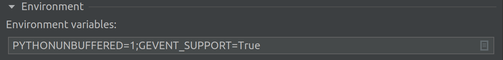

## Performance Test

### Development environment setup

In general, we use Pycharm for scripts development on **Ubuntu 20**.

#### Prerequisites
- Python 3.7 or higher version
- Pip 20.x or higher version

#### Setup scripts development environment

- Open code in Pycharm
- Install requirements
```shell
sudo apt-get install libsasl2-dev

pip install -r requirements.txt 
```
- Setup Run/Debug Configurations

environment variables add

```text
PYTHONUNBUFFERED=1;GEVENT_SUPPORT=True
```
 
- Run bootstrap scripts
```shell
python3 statistic.py [args]
```

### Example
#### Arguments description
using `--help` to show how arguments details.
```text
optional arguments:
  -h, --help            show this help message and exit
  --iterations ITERATIONS, -i ITERATIONS
                        Iteration limit , stops Locust after a certain number of task iterations
  --output-dir OUTPUT_DIR, -o OUTPUT_DIR
  --engine ENGINE, -e ENGINE
                        used connection engine, eg. mysql, clickhouse, hive, starrocks
  --sql-path SQL_PATH   sql full path which search sql dialect. eg. /temp
  --dialect DIALECT     dialect. Will find sql in {sql-path}/{dialect}/. Support starrocks, clickhouse, ansi
  --host HOST           host
  --port PORT, -p PORT  port
  --user USER, -u USER  user
  --password PASSWORD   password
  --database DATABASE, -d DATABASE
                        database
  --external-path EXTERNAL_PATH
                        If not empty, it will query with external tables.
  --metastore-uris METASTORE_URIS
  --drop-table-before-create DROP_TABLE_BEFORE_CREATE
                        drop table before create
  --create-table-only CREATE_TABLE_ONLY
                        Will not running queries
  --data-format DATA_FORMAT
                        mergetree or parquet
  --column-nullable COLUMN_NULLABLE
                        allow column null
```

### for gluten
```shell
python statistic.py \
--iterations 1 \
--sql-path /sqls/query \
--dialect gluten \
--engine gluten \
--output-dir /result \
--port 10000 \            # thrift server port
--host localhost \
--user default \
--database default_database \
--external-path hdfs://localhost:8020/tmp/tpch-data-sf100 \
--data-format parquet
```

### for starrocks
```shell
python statistic.py \
--iterations 1
--sql-path /sqls/query \
--dialect starrocks \
--engine starrocks \
--output-dir /result \
--port 9030 \
--host localhost \
--user default \
--database default_database \
--external-path hdfs://localhost:8020/tmp/tpch-data-sf100 \
--metastore-uris thrift://localhost:9083
```

### for hive
```shell
python statistic.py \
--dialect hive \
--engine hive \
--port 10000 \
--host localhost \
--user default \
--database default_database \
--external-path hdfs://localhost:8020/tmp/tpch-data-sf100
```
